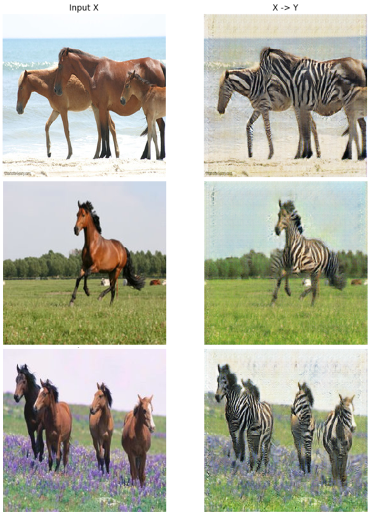
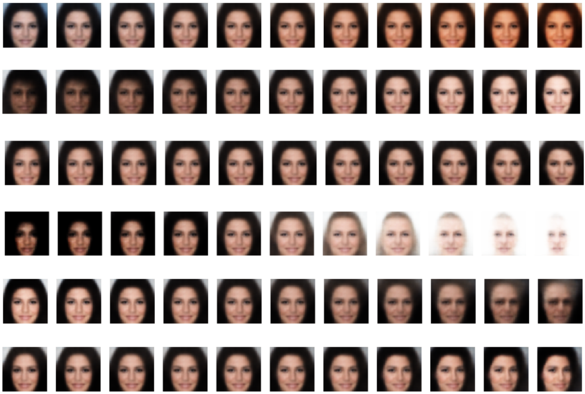

# Generative Models

- This repository is for implementation of `Generative Models` using [Tensorflow](https://www.tensorflow.org) 1.12

- [Description of the Papers (Korean)](https://www.notion.so/Code-Description-53c93afd0b9740728143ffab1b2caa2f)

- The structure of the code is based on the [Hwalsuk Lee's Generative Model github repository](https://github.com/hwalsuklee/tensorflow-generative-model-collections)  

 

## Contributors

[MMC Lab](http://mmc.hanyang.ac.kr/) GAN Study Group members

- [Kyushik Min](https://github.com/Kyushik), [Gihoon Kim](https://github.com/GihoonKim), [Hyukju Sohn](https://github.com/Hyukju-Sohn), [Yoonyong Ahn](https://github.com/YoonyongAhn), [Seungwon-Choi](https://github.com/seungwon-Choi), [Jongyoon Baek](https://github.com/whd2345)

 

## Implemented Paper List (18 Papers)

### GAN

1. [[GAN] Generative Adversarial Networks](https://arxiv.org/abs/1406.2661)
2. [[DCGAN] Unsupervised Representation Learning with Deep Convolutional Generative Adversarial Networks](https://arxiv.org/abs/1511.06434)
3. [[LSGAN] Least Squares Generative Adversarial Networks](https://arxiv.org/abs/1611.04076)
4. [[WGAN] Wasserstein GAN](https://arxiv.org/abs/1701.07875)
5. [[WGAN_GP] Improved Training of Wasserstein GANs](https://arxiv.org/abs/1704.00028)
6. [[CGAN] Conditional Generative Adversarial Nets](https://arxiv.org/abs/1411.1784)
7. [[InfoGAN] Interpretable Representation Learning by Information Maximizing Generative Adversarial Nets](https://arxiv.org/abs/1606.03657)
8. [[HoloGAN] Unsupervised Learning of 3D Representations From Natural Images](https://arxiv.org/abs/1904.01326)
9. [[SinGAN] Learning a Generative Model from a Single Natural Image](https://arxiv.org/pdf/1905.01164.pdf)
10. [[PGGAN] Progressive Growing of GANs for Improved Quality, Stability, and Variation](https://arxiv.org/pdf/1710.10196.pdf)

### Image-to-Image Translation

1. [[CycleGAN] Unpaired Image-to-Image Translation using Cycle-Consistent Adversarial Networks](https://arxiv.org/abs/1703.10593)
2. [[AGGAN] Attention-Guided Generative Adversarial Networks for Unsupervised Image-to-Image Translation](https://arxiv.org/abs/1903.12296)
3. [[StarGAN] Unified Generative Adversarial Networks for Multi-Domain Image-to-Image Translation](https://arxiv.org/abs/1711.09020)
4. [[DMIT] Multi-mapping Image-to-Image Translation via Learning Disentanglement](https://arxiv.org/pdf/1909.07877.pdf)

### Interpretable GAN Latent

1. [Unsupervised Discovery of Interpretable Directions in the GAN Latent Space](https://arxiv.org/abs/2002.03754)

### VAE

1. [Auto-Encoding Variational Bayes (VAE)](https://arxiv.org/abs/1312.6114)
2. [Beta-VAE: Learning Basic Visual Concepts with a Constrained Variational Framework](https://openreview.net/forum?id=Sy2fzU9gl)
3. [Neural Discrete Representation Learning(VQ-VAE)](https://arxiv.org/abs/1711.00937)

### Application

1. [Adherent Raindrop Removal with Self-Supervised Attention Maps andSpatio-Temporal Generative Adversarial Networks](http://openaccess.thecvf.com/content_ICCVW_2019/papers/ADW/Alletto_Adherent_Raindrop_Removal_with_Self-Supervised_Attention_Maps_and_Spatio-Temporal_Generative_ICCVW_2019_paper.pdf)

 

# Our Results

## GAN Results

### 1. GAN

**MNIST**

 

### 2. DCGAN

|                      MNIST                      |                      CelebA                      |
| :---------------------------------------------: | :----------------------------------------------: |
|  |  |

 

### 3. LSGAN

|                      MNIST                      |                      CelebA                      |
| :---------------------------------------------: | :----------------------------------------------: |
|  |  |

 

### 4. WGAN

|                     MNIST                      |                     CelebA                      |
| :--------------------------------------------: | :---------------------------------------------: |
|  |  |

 

### 5. WGAN-GP

|                       MNIST                       |                       CelebA                       |
| :-----------------------------------------------: | :------------------------------------------------: |
|  |  |

 

### 6. Conditional GAN

**MNIST**

 

### 7. InfoGAN

**MNIST**

 

### 8. HoloGAN

**CelebA**

 

### 9. SinGAN

**Balloon**

**Mountain**

**Starry Night**

 

### 10. PGGAN
**Cherry picked images**

\
**Latent interpolation**

\
**Fixed latent**

\
**No cherry picked images**

 

## Image-to-Image Translation Results

### 1. CycleGAN

|                      Monet to Photo                      |                      Photo to Monet                      |
| :------------------------------------------------------: | :------------------------------------------------------: |
|  |  |

|                      Horse to Zebra                      | Zebra to Horse                                           |
| :------------------------------------------------------: | -------------------------------------------------------- |
|  |  |

 

### 2. AGGAN

|                    Horse to Zebra                     |                    Zebra to Horse                     |
| :---------------------------------------------------: | :---------------------------------------------------: |
|  |  |

 

### 3. StarGAN

**CelebA**

 

### 4. DMIT

**Summer2Winter**

 

## Interpretable GAN Latent

### 1. Unsupervised Discovery of Interpretable Directions in the GAN Latent Space

#### 1) MNIST

 

## VAE Results

### 1. VAE

**Reconstruction**

|                        MNIST                        |                        CelebA                        |
| :-------------------------------------------------: | :--------------------------------------------------: |
|  |  |

**Latent Space Interpolation (MNIST)**

**Latent Space Interpolation (CelebA)**

 

### 2. Beta-VAE

**Latent Space Interpolation: Beta = 10 (CelebA)**

**Latent Space Interpolation: Beta = 200 (CelebA)**

 

### 3. VQ-VAE

**Reconstruction (MNIST)**

|                         Input                          | Reconstruction                                         |
| :----------------------------------------------------: | ------------------------------------------------------ |
|  |  |

**Reconstruction (CelebA)**

|                          Input                          |                     Reconstruction                      |
| :-----------------------------------------------------: | :-----------------------------------------------------: |
|  |  |

**PixelCNN Trained Latent Decoding**

|                          MNIST                          |                          CelebA                          |
| :-----------------------------------------------------: | :------------------------------------------------------: |
|  |  |

 

## Application Results

### 1. Raindrop Removal

