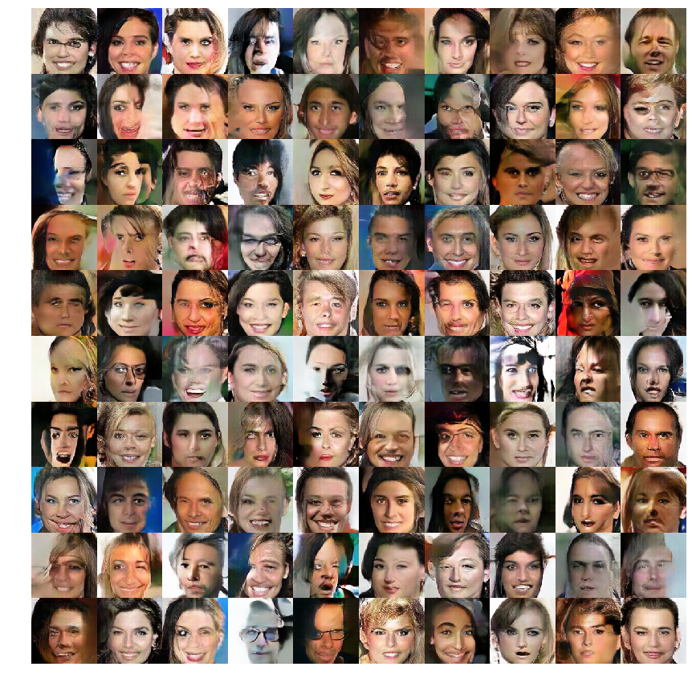
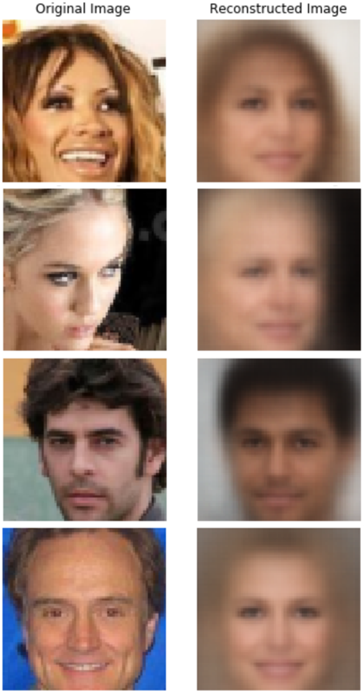

# Generative Models

This repository is for implementation of `Generative Models` using [Tensorflow](https://www.tensorflow.org). 

[Description of the Papers (Korean)](https://www.notion.so/Code-Description-53c93afd0b9740728143ffab1b2caa2f)

The structure of the code is based on the [Hwalsuk Lee's Generative Model github repository](https://github.com/hwalsuklee/tensorflow-generative-model-collections)  

## Implemented Paper List

1. [Auto-Encoding Variational Bayes (VAE)](https://arxiv.org/abs/1312.6114)
2. [Generative Adversarial Networks (GAN)](https://arxiv.org/abs/1406.2661)
3. [Unsupervised Representation Learning with Deep Convolutional Generative Adversarial Networks (DCGAN)](https://arxiv.org/abs/1511.06434)
4. [Least Squares Generative Adversarial Networks (LSGAN)](https://arxiv.org/abs/1611.04076)
5. [Wasserstein GAN (WGAN)](https://arxiv.org/abs/1701.07875)
6. [Improved Training of Wasserstein GANs (WGAN GP)](https://arxiv.org/abs/1704.00028)
7. [Conditional Generative Adversarial Nets (CGAN)](https://arxiv.org/abs/1411.1784)
8. [Interpretable Representation Learning by Information Maximizing Generative Adversarial Nets (InfoGAN)](https://arxiv.org/abs/1606.03657)
9. [Unpaired Image-to-Image Translation using Cycle-Consistent Adversarial Networks (CycleGAN)](https://arxiv.org/abs/1703.10593)
10. [Unified Generative Adversarial Networks for Multi-Domain Image-to-Image Translation (StarGAN)](https://arxiv.org/abs/1711.09020)
11. [Attention-Guided Generative Adversarial Networks for Unsupervised Image-to-Image Translation (AGGAN)](https://arxiv.org/abs/1903.12296)
12. [Neural Discrete Representation Learning(VQ-VAE)](https://arxiv.org/abs/1711.00937)
13. [Adherent Raindrop Removal with Self-Supervised Attention Maps andSpatio-Temporal Generative Adversarial Networks](http://openaccess.thecvf.com/content_ICCVW_2019/papers/ADW/Alletto_Adherent_Raindrop_Removal_with_Self-Supervised_Attention_Maps_and_Spatio-Temporal_Generative_ICCVW_2019_paper.pdf)

14. [Beta-VAE: Learning Basic Visual Concepts with a Constrained Variational Framework](https://openreview.net/forum?id=Sy2fzU9gl)

15. [HoloGAN: Unsupervised Learning of 3D Representations From Natural Images](https://arxiv.org/abs/1904.01326)

## GAN Results

### 1. GAN

**MNIST**

### 2. DCGAN

|                      MNIST                      |                      CelebA                      |
| :---------------------------------------------: | :----------------------------------------------: |
|  |  |

### 3. LSGAN

|                      MNIST                      |                      CelebA                      |
| :---------------------------------------------: | :----------------------------------------------: |
|  |  |

### 4. WGAN

|                     MNIST                      |                     CelebA                      |
| :--------------------------------------------: | :---------------------------------------------: |
|  |  |

### 5. WGAN-GP

|                       MNIST                       |                       CelebA                       |
| :-----------------------------------------------: | :------------------------------------------------: |
|  |  |

### 6. Conditional GAN

**MNIST**

### 7. InfoGAN

**MNIST**

### 8. HoloGAN

**CelebA**

## Image-to-Image Translation Results

### 1. CycleGAN

|                      Monet to Photo                      |                      Photo to Monet                      |
| :------------------------------------------------------: | :------------------------------------------------------: |
|  |  |

|                      Horse to Zebra                      | Zebra to Horse                                           |
| :------------------------------------------------------: | -------------------------------------------------------- |
|  |  |

### 2. AGGAN

|                    Horse to Zebra                     |                    Zebra to Horse                     |
| :---------------------------------------------------: | :---------------------------------------------------: |
|  |  |

### 3. StarGAN

**CelebA**

## VAE Results

### 1. VAE

**Reconstruction**

|                        MNIST                        |                        CelebA                        |
| :-------------------------------------------------: | :--------------------------------------------------: |
|  |  |

**Latent Space Interpolation (MNIST)** 

**Latent Space Interpolation (CelebA)** 

### 2. Beta-VAE

**Latent Space Interpolation: Beta = 10 (CelebA)** 

**Latent Space Interpolation: Beta = 200 (CelebA)** 

### 3. VQ-VAE

**Reconstruction (MNIST)** 

|                         Input                          | Reconstruction                                         |
| :----------------------------------------------------: | ------------------------------------------------------ |
|  |  |

**Reconstruction (CelebA)** 

|                          Input                          |                     Reconstruction                      |
| :-----------------------------------------------------: | :-----------------------------------------------------: |
|  |  |

**PixelCNN Trained Latent Decoding**

|                          MNIST                          |                          CelebA                          |
| :-----------------------------------------------------: | :------------------------------------------------------: |
|  |  |

## Application Results

### 1. Raindrop Removal

